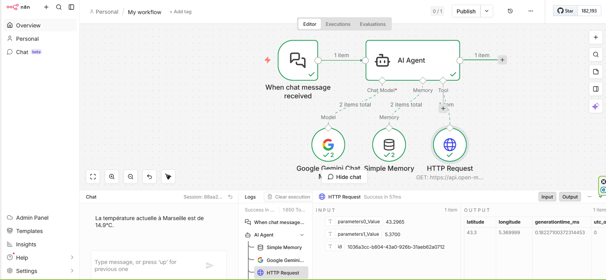
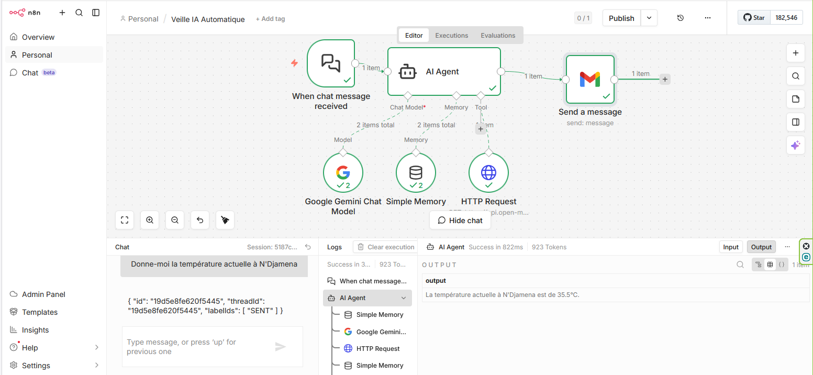

# Agent IA Météo Autonome (n8n + Gemini)

Ce projet a été réalisé dans le cadre de mon cursus en **Deep Learning** à l'**Université Aix-Marseille**. Il démontre la capacité d'un LLM à agir comme un agent capable d'utiliser des outils externes de manière autonome.

## Fonctionnalités
- **Mémoire conversationnelle** : L'agent se souvient du contexte des échanges (ex: le nom de l'utilisateur).
- **Utilisation d'outils (Tools)** : L'agent identifie quand il a besoin d'une information externe.
- **Appel d'API en temps réel** : Extraction automatique des coordonnées géographiques pour interroger l'API Open-Meteo.
- **Notifications Automatisées** : Envoi automatique du rapport météo généré par l'IA directement par email via Gmail.

## Stack Technique
- **n8n** : Plateforme d'automatisation (Workflow).
- **Google Gemini** : Modèle de langage (LLM) servant de "cerveau".
- **Open-Meteo API** : Source de données pour la météo en temps réel.
- **Window Buffer Memory** : Pour la gestion du contexte.
- **Gmail API** : Pour la distribution automatique des résultats à l'utilisateur.

## Aperçu du Workflow

## Aperçu du Workflow avec Gmail

## 📖 Comment l'utiliser ?
1. Importer le fichier `workflow_meteo_agent.json` dans votre instance n8n.
2. Configurer vos credentials pour Google Gemini et Gmail (OAuth2).
3. Tester via le chat intégré !
4. Vérifier votre boîte de réception !
